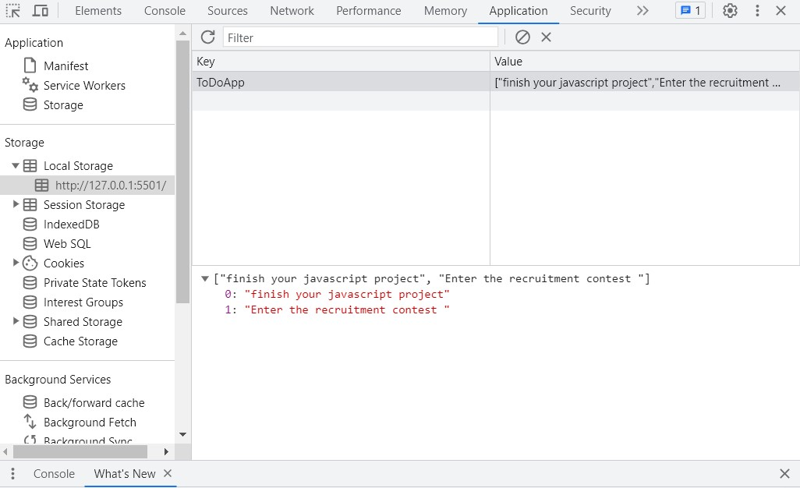

## JavaScript_Study_2

### [patika](https://academy.patika.dev/tr/profile)
### [Click this link for Javascript Time and Welcome Preview](https://kaderergin.github.io/JavaScript/Javascript_Study_2/) 

> ToDoApp anahtarı içerisine gönderilen değerler dinamik olarak array ve localstorage içerisinde tutulur.

 
 

[EN]  

#### Features of this project

[TR]  
#### Proje genel açıklama
#### Bu projenin özellikleri
* JavaScript kodu içerisinde yapılacaklar listesine element eklemeyi, element silmeyi, yapıldı işaretlenmesini sağlayan bir fonksiyon yapısı bulunmaktadır.
* Listeye boş karakter eklenmek istendiğinde veya herhangi bir değer girişi yapılmadığında toast bildirimi sağ üst köşede (You cannot add blanks to do list!) ekrana gelir.
* Listeye yeni element eklendiğinde toast bildirimi sağ üst köşede (Added to the list) ekrana gelir.
* Projede Bootstrap versiyon 4.6.0 kullanılmıştır.
* Yapılacaklar listesini kaydetmek için yerel depolamayı kullanır, böylece sayfa yenilense veya kapatılsa bile listeye erişilebilir.
* Yani projedeki yapıda Local Storage sayesinde listeye girilen verilerin kaybolmamasını sağlanmış oluruz.
* Web sayfası arka planı ve metin kutusu için karanlık mod,normal mod özelliği sol üst köşeseki butona tıklanarak aktif hale getirilir.
* Maddeler halinde belirtilen bu özellikleri yukarıdaki videodan
* Projenin önizlemesine ise yukarıda verilen linkten erişebilirsiniz.

#### Technologies
1. JavaScript
1. HTML
1. CSS
1. Bootstrap
