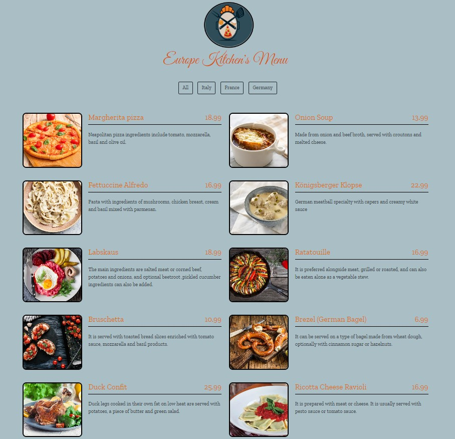

## JavaScript_Study_3(european-cuisine-menu)
### [patika](https://academy.patika.dev/tr/profile)
### For European cuisine menu project preview [Click  this link](https://kaderergin.github.io/JavaScript/Javascript_Study_3/) 

> (European-cuisine-menu) project screenshot

> (European-cuisine-menu) project gif

#### Technologies
1. JavaScript
1. HTML
1. CSS
1. Bootstrap
